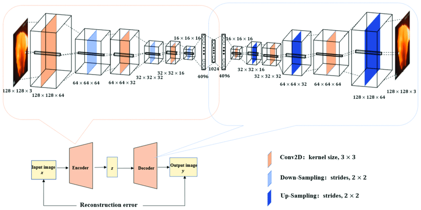

# inpainting

https://www.kaggle.com/datasets/jessicali9530/celeba-dataset

https://www.kaggle.com/datasets/badasstechie/celebahq-resized-256x256

IMAGENET128: https://www.kaggle.com/datasets/akash2sharma/tiny-imagenet/data

TINY IMAGENET http://cs231n.stanford.edu/tiny-imagenet-200.zip

https://github.com/unsplash/datasets

https://shotdeck.com/

https://shotdeck.com/browse/stills#

* https://paperswithcode.com/datasets?task=image-inpainting

https://paperswithcode.com/dataset/imagenet

* https://paperswithcode.com/dataset/unsplash-1k (used for the masks)

* https://www.kaggle.com/datasets/quadeer15sh/image-super-resolution-from-unsplash (used for the images)

https://github.com/JBlitzar/cnn-experiments

step 1: autoencoder ✔️ (mnist)

step 2: convolutional autoencoder ✔️ (imagenet)

reccommended convolutional layers getting smaller, flatten at bottom, conv getting bigger (make sure architecture is symmetric)

All conv layers, dont flatten (still works, harder-to-work-with bottleneck)

step 3: inpainting 

inpainting (content aware fill) input it to the autoencoder, reconstruct it with those features. Train it so that a box covering an area decodes to a complete image.

Traversing feature space?
